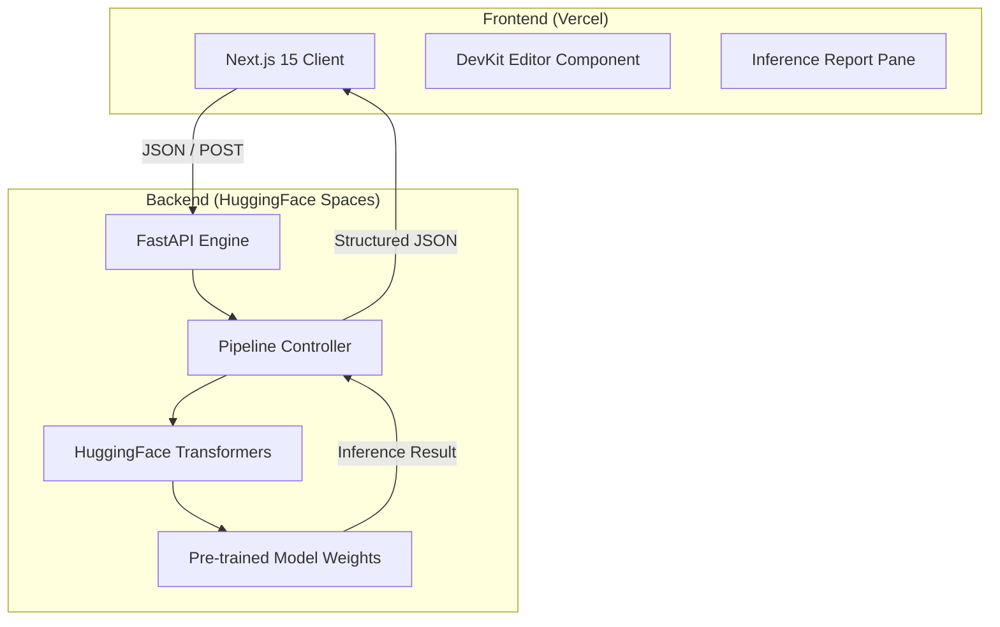

# 🤖 Multi-Task NLP Intelligence Suite | Documentation

> **Status:** Production Ready  
> **Version:** 1.0.0  
> **Aesthetic:** Dark DevKit / Minimalist Neon

[](https://nlp-suite-project.vercel.app/)
[](https://huggingface.co/spaces/Ami-Lab/nlp-suite-backend)
[](https://nlp-suite-project.vercel.app/)

---

## 🌩️ Overview

The **Multi-Task NLP Intelligence Suite** is a high-performance, full-stack neural computing platform designed to provide instant linguistic intelligence. It centralizes five core NLP tasks—Summarization, Sentiment Analysis, Zero-Shot Classification, Named Entity Recognition, and Question Answering—into a unified, developer-centric interface.

Inspired by modern IDEs and low-level development kits, the suite offers a **"DevKit" aesthetic** that prioritizes code-first inputs and detailed inference reporting.

---

## 🏗️ System Architecture

The project follows a decoupled client-server architecture optimized for high-latency transformer model inference.



### 🧰 Technology Stack

| Layer | Technology | Purpose |
| :--- | :--- | :--- |
| **Frontend** | Next.js 15 (App Router) | Core application framework. |
| **Styling** | Tailwind CSS 4 | Modern, utility-first design system. |
| **Icons** | Lucide React | Minimalist glyphs for UI elements. |
| **Backend** | FastAPI (Python 3.10+) | High-performance asynchronous API. |
| **ML Engine** | PyTorch + Transformers | Neural network execution. |
| **Models** | BART, RoBERTa, BERT | Specialized SOTA model architectures. |

---

## 🧠 Neural Modules (The Engines)

Each module utilizes a specific State-of-the-Art (SOTA) model optimized for its task.

### 1. 📝 Text Summarization
- **Model:** `facebook/bart-large-cnn`
- **Capabilities:** Handles long-form documents via a recursive chunking algorithm (900-word segments) to bypass the 1024-token BART limit.
- **Output:** Concise summary with compression ratio metrics.

### 2. 😊 Sentiment Analysis
- **Model:** `cardiffnlp/twitter-roberta-base-sentiment-latest`
- **Capabilities:** Multi-label emotion detection (Positive, Neutral, Negative) with confidence scoring.
- **Threshold:** `SENTIMENT_CONFIDENCE_THRESHOLD = 0.5`

### 3. 🎯 Zero-Shot Classification
- **Model:** `facebook/bart-large-mnli`
- **Capabilities:** Classifies text into arbitrary categories provided at runtime without specific model training for those categories.
- **Flexibility:** Supports multi-label classification.

### 4. 🏷️ Named Entity Recognition (NER)
- **Model:** `dslim/bert-base-NER`
- **Capabilities:** Identifies `PER` (Person), `ORG` (Organization), `LOC` (Location), and `MISC`.
- **UI Feature:** High-end annotated text highlighting with color-coded tokens.

### 5. ❓ Contextual Q&A
- **Model:** `deepset/roberta-base-squad2`
- **Capabilities:** Extracts precise answers from a context paragraph.
- **Threshold:** `QA_ANSWERABLE_THRESHOLD = 0.10`

---

## 📡 API Reference

All requests must be `POST` with `Content-Type: application/json`.

### Summarize Text
`POST /summarize`

| Parameter | Type | Default | Description |
| :--- | :--- | :--- | :--- |
| `text` | string | REQUIRED | The input text to condense. |
| `max_length` | int | 80 | Max summary length. |
| `min_length` | int | 25 | Min summary length. |

**Sample Shell Command:**
```bash
curl -X POST "https://your-api.com/summarize" \
  -H "Content-Type: application/json" \
  -d '{"text": "Long document content...", "max_length": 100}'
```

---

### Sentiment Analysis
`POST /sentiment`

| Parameter | Type | Default | Description |
| :--- | :--- | :--- | :--- |
| `text` | string | REQUIRED | Input string for emotional analysis. |

**Response Schema:**
```json
{
  "label": "POSITIVE",
  "confidence": 0.9845,
  "low_confidence": false,
  "all_scores": [
    { "label": "POSITIVE", "score": 0.9845 },
    { "label": "NEUTRAL", "score": 0.0150 },
    { "label": "NEGATIVE", "score": 0.0005 }
  ]
}
```

---

### Zero-Shot Classification
`POST /zero-shot`

| Parameter | Type | Default | Description |
| :--- | :--- | :--- | :--- |
| `text` | string | REQUIRED | Data to classify. |
| `labels` | list[str] | REQUIRED | Candidate categories (e.g., ["tech", "sports"]). |
| `multi_label`| bool | false | Allow multiple labels per text. |

---

### Named Entity Recognition
`POST /ner`

**Example Response Trace:**
```json
{
  "entities": [
    { "word": "Tesla", "entity_type": "ORG", "score": 0.999, "start": 0, "end": 5 }
  ],
  "entity_count": 1,
  "annotated_text": "[Tesla/ORG] announced new factory..."
}
```

---

## 🎨 Interface Guide (The "DevKit" UI)

The frontend is designed to feel like an extension of your development environment.

### 🌑 Dashboard Elements
- **Sidebar (Explorer):** Switch between `.ts` file simulations for each NLP module.
- **Terminal Input:** Styled textarea with line numbers and pseudo-code syntax (`const inputData = ...`).
- **Inference Report:** A dedicated right-pane for visualizing results with progress bars, probability matrices, and token highlighting.
- **Activity Status:** Real-time "CONNECTED" heartbeat and version tracking.

### 🛠️ Interactive Features
- **Execute Trace:** Trigger the neural inference with a sleek, glowing button.
- **Annotated Text Rendering:** Interactive entity labels within the NER report.
- **Live cURL Export:** Generates code snippets based on your current input for easy API integration.

---

## 🚀 Deployment & Local Setup

### Prerequisites
- Python 3.10+
- Node.js 18+
- PyTorch (CPU or GPU)

### Local Development (Backend)
1. Clone the repository.
2. Create virtual environment: `python -m venv venv`
3. Install dependencies: `pip install -r requirements.txt`
4. Run server: `python -m uvicorn app.main:app --reload`

### Local Development (Frontend)
1. Navigate to `frontend/`.
2. Install dependencies: `npm install`
3. Configure `.env.local`: `NEXT_PUBLIC_API_URL=http://127.0.0.1:8000`
4. Start dev server: `npm run dev`

---

## 🔒 License & Credits

Built with ❤️ by **Ami-Lab**.  
Powered by **Hugging Face Transformers** and **Next.js**.

- **Maintainer:** [Amiru Mallawarachchi](https://github.com/AmiruMallawarachchi)
- **Repo:** [nlp-suite-project](https://github.com/AmiruMallawarachchi/nlp-suite-project)

---

> [!TIP]
> **Performance Optimization:** For production use, it is highly recommended to run the backend on a GPU-enabled instance. The application automatically detects and utilizes `cuda:0` if available.
